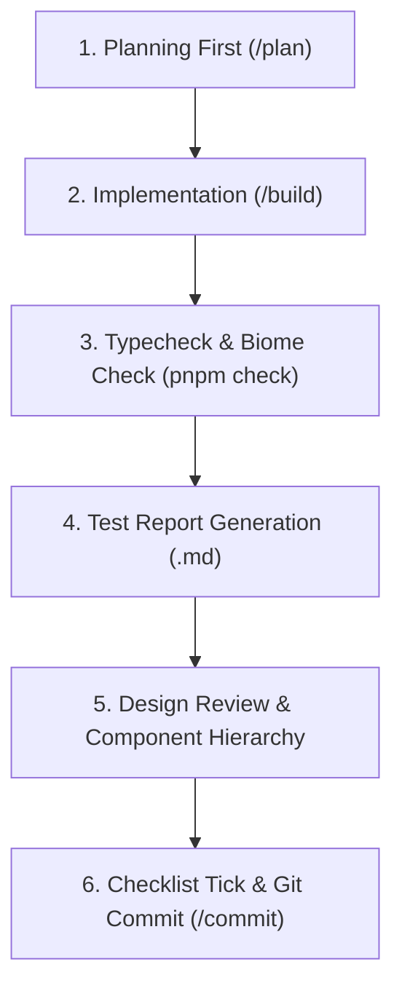

# AGENTS.md — TrekSphere Frontend Engineering Guidelines (React 19 + TypeScript)

> **Purpose:** Master guidelines and standard operating procedures for AI Coding Agents and Frontend Developers working within the **TrekSphere_FE** repository.

---

## 1. Documentation Language Policy (MANDATORY)

- **Skills & Rules Language:** Prompts, skills, and rulebooks are written in **English**.
- **Generated Documentation Language:** All user-facing documents, implementation plans, test reports, and design reviews (`docs/Versions/...`, `docs/Reports/...`) MUST be written in **Vietnamese (Tiếng Việt)**.
- **Diagrams & Technical Terms:** All diagrams (Mermaid Component Hierarchy Diagrams, State Machines), route paths, CSS classes, and code identifiers remain in **English / Standard Technical Syntax**.

---

## 2. Tech Stack & Architecture

- **Framework**: React 19 + TypeScript + Vite
- **Styling**: Tailwind CSS v4
- **State Management**: Zustand (Client Global State) + TanStack React Query (Server API State)
- **Forms & Validation**: React Hook Form + Zod validation
- **UI Components**: shadcn/ui (base-nova style)
- **Linting & Formatting**: Biome
- **Git Hooks**: Lefthook (pre-commit, commit-msg, pre-push)
- **Package Manager**: pnpm (v11.9.0+)

### Feature-Sliced Design (FSD) Structure

```
src/
├── assets/          # Static assets (Images, global CSS)
├── components/      # shadcn/ui base components
├── config/          # Global configuration (apiClient, queryClient)
├── constants/       # App constants (paths, roles, enums)
├── features/        # Business feature modules (auth, dashboard, tours, matching-group...)
│   ├── components/  # Feature-specific components
│   ├── hooks/       # Custom React Query & UI hooks
│   ├── services/    # Feature API services
│   ├── types/       # TypeScript interfaces & types
│   ├── validations/ # Zod schema validation
│   └── pages/       # Feature page entrypoints
├── hooks/           # Shared general React hooks
├── lib/             # Utility libraries (formatting, cn helper)
├── routes/          # Application routing (AppRoutes.tsx)
├── services/        # Common API services
├── shared/          # Reusable cross-domain modules
│   ├── hooks/       # Shared hooks
│   ├── layout/      # Common layout wrappers
│   └── ui/          # Shared UI components (MUST have App* prefix)
├── store/           # Zustand global stores
└── utils/           # Utility helpers
```

---

## 3. Mandatory 5-Step Engineering Lifecycle



---

### 🔹 Step 1: Planning First
- Do NOT write code without a user-approved implementation plan.
- Create or update the plan (e.g., `docs/Versions/04_09/matching_group_implementation_plan.md`) in **Vietnamese** with clear stage breakdowns and checklist items `[ ]`.

---

### 🔹 Step 2: Clean Implementation
Strictly adhere to [`.agents/skills/fe-rules/SKILL.md`](../.agents/skills/fe-rules/SKILL.md):
- **Component Naming:**
  - Shared UI components (`src/shared/ui/`): MUST use **`App`** prefix (`AppButton`, `AppInput`, `AppCard`, `AppModal`, `AppBadge`).
  - Feature components: Use PascalCase without prefix (`TourCard`, `GroupFilterBar`).
- **Component Declarations:** Use `export function ComponentName() {}` instead of arrow functions.
- **Service Layer:** NEVER invoke raw `axios` or `fetch` inside UI components. All requests must go through service files.
- **Forms & Validation:** Always use React Hook Form + Zod via `@hookform/resolvers/zod`.
- **State Management:** Use TanStack React Query for asynchronous API data; use Zustand only for true global client state.
- **Code Hygiene:** Never use `any`, remove dead code, `console.log`, and commented-out blocks.
- **Feature Structure:** Keep pages for route composition; place reusable UI in `components/`, query orchestration in `hooks/`, API transport in `services/`, DTO/domain models in `types/`, Zod schemas in `validations/`, and reusable business/config values in `constants/`.
- **Component Size Gate:** Review decomposition at 150 lines. Components/pages over 250 lines MUST be split before completion unless the design review records a concrete exception.
- **No Magic Values:** Extract repeated or business-significant status/role/action codes, limits, pagination sizes, timeouts, filter/sort options, and state-label maps into typed constant modules. One-off display copy and Tailwind utilities may remain local.
- **Style Placement:** Keep ordinary Tailwind utilities in JSX. Put only complex animations, unsupported selectors, and third-party overrides in feature-specific `styles/` files; do not hardcode colors when theme tokens exist.
- **Architecture Gate:** Apply [the frontend structure checklist](../.agents/skills/fe-rules/references/frontend-structure-checklist.md) before reporting a frontend stage complete.

---

### 🔹 Step 3: Type Checking & Linting
- After writing code, run terminal verification commands:
  ```bash
  pnpm typecheck
  pnpm check
  ```
- Auto-fix format issues: `pnpm check:fix`

---

### 🔹 Step 4: UI Test Report Generation
- Create or update test report markdown files in `docs/Versions/<date>/test_reports/` in **Vietnamese**:
  - Summary table with anchor links `[TC-FE-xxx](#tc-fe-xxx)`.
  - Detailed test cases: UI states (Loading/Empty/Error/Success), form validations (Zod/RHF), user interactions (dialogs, pagination, search), and API handling (Toasts, Error Boundaries, Roles).

---

### 🔹 Step 5: Design Review & Component Hierarchy Diagrams
- Create design review documents in `docs/Versions/<date>/design_reviews/` in **Vietnamese**:
  1. **Component Hierarchy Diagram (Mermaid graph in English):** Page ──► Feature Components ──► Shared UI (`App*`).
  2. **UI State Machine Diagram (Mermaid stateDiagram / flowchart in English):** Interaction and state transition flows.
  3. **Interaction & UX Narrative (in Vietnamese):** Detailed review covering UX, responsive design, and edge cases.

---

### 🔹 Step 6: Progress Tracking & Git Commit
- Automatically check off completed tasks `[x]` in `implementation_plan.md`.
- When user runs `/commit`:
  - Follow [`.agents/skills/git-guidelines/SKILL.md`](../.agents/skills/git-guidelines/SKILL.md).
  - Summarize changes and ask for confirmation before committing.

---

## 4. Setup & Development Commands

```bash
# Install dependencies
pnpm install

# Start development server
pnpm dev

# Type check
pnpm typecheck

# Biome lint and format
pnpm check
pnpm check:fix

# Production build
pnpm build
```

---

## 5. Git Hooks & Conventional Commits

Lefthook automatically runs:
- `pre-commit`: Runs `pnpm biome check --write --staged`.
- `commit-msg`: Verifies Conventional Commit format.
- `pre-push`: Runs `pnpm typecheck` before push.

### Commit Format
`<type>(<scope>): <short description in English>`
- *Example:* `feat(matching-group): implement group card and discovery list UI`
